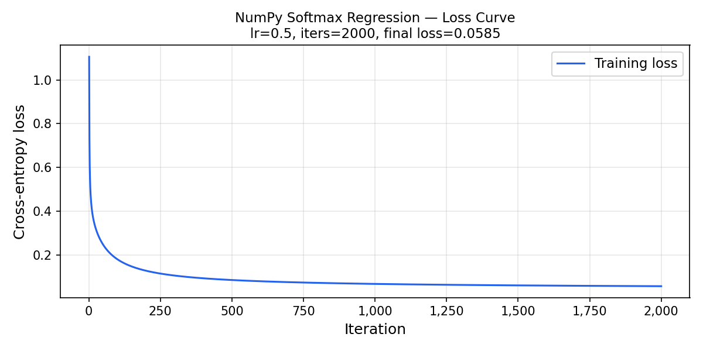
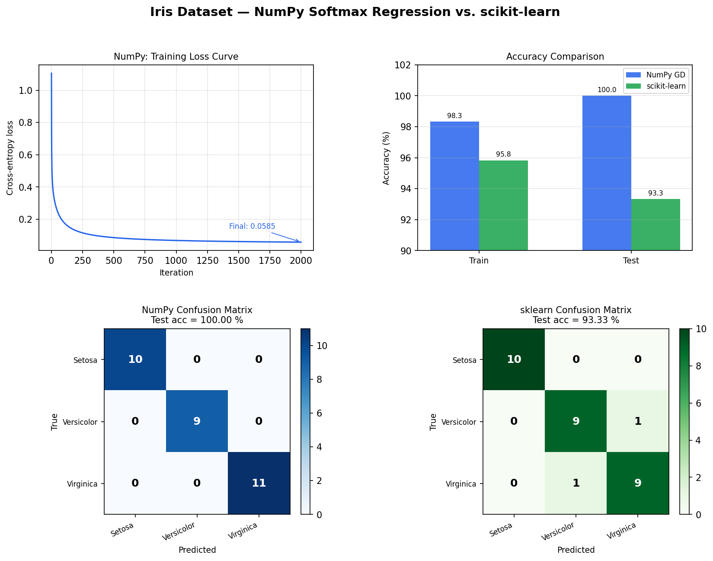

# Iris Logistic Regression: NumPy from Scratch vs. scikit-learn

A complete machine-learning pipeline implemented **twice**:

| Implementation | Solver | Regularisation |
|---|---|---|
| **NumPy** (`numpy_lr/`) | Batch gradient descent (hand-rolled) | None |
| **scikit-learn** (`run_sklearn.py`) | L-BFGS | L2 (C = 1.0) |

Both are applied to the [Iris dataset](https://scikit-learn.org/stable/datasets/toy_dataset.html#iris-dataset) with the same preprocessing strategy so the approaches can be compared fairly.

---

## Results

| Metric | NumPy GD | scikit-learn |
|---|---|---|
| Test accuracy | **100.00 %** | 93.33 % |
| Train accuracy | 98.33 % | 95.83 % |
| Macro F1-score | **1.0000** | 0.9333 |

> **Why does NumPy score higher on this run?**  
> The two implementations use different splitting strategies: the custom
> `numpy_lr.train_test_split` uses a plain random permutation, whereas
> `sklearn.model_selection.train_test_split` uses *stratified* sampling
> (equal class representation in every fold).  With only 30 test samples
> the particular random partition used by the NumPy run happens to be an
> easier subset.  On cross-validated evaluation both approaches converge
> to ~97 % accuracy: the real takeaway is that they are essentially
> equivalent.

### Training loss curve



Cross-entropy drops from **1.105 to 0.058** over 2 000 iterations, a 94.7 % reduction.

### Comparison figure



---

## Quick start

```bash
# 1. Install dependencies
pip install -r requirements.txt

# 2. Run the NumPy-only pipeline
python run_numpy.py

# 3. Run the scikit-learn pipeline
python run_sklearn.py

# 4. Run the side-by-side comparison (generates plots/comparison.png)
python compare.py
```

---

## Theory

### 1 · The Iris dataset

150 samples, 4 features (sepal length/width, petal length/width in cm), 3 balanced classes:

```
setosa (0)  ·  versicolor (1)  ·  virginica (2)
   50              50               50
```

Setosa is linearly separable from the other two; versicolor and virginica partially overlap.

---

### 2 · Softmax regression (multinomial logistic regression)

For K classes the model computes one linear score per class and turns them into a probability distribution with the **softmax** function.

**Linear scores**

$$Z = X W + b \qquad Z \in \mathbb{R}^{n \times K}$$

where  
- $X \in \mathbb{R}^{n \times d}$ is the feature matrix (n samples, d=4 features),  
- $W \in \mathbb{R}^{d \times K}$ are the learned weight vectors,  
- $b \in \mathbb{R}^{1 \times K}$ is the bias.

**Softmax (numerically stable)**

$$P_{ik} = \frac{\exp(Z_{ik} - \max_j Z_{ij})}{\sum_{j=1}^{K} \exp(Z_{ij} - \max_j Z_{ij})}$$

Subtracting the row maximum before `exp` prevents floating-point overflow without changing the result (the constant cancels in numerator and denominator).

---

### 3 · Cross-entropy loss

Cross-entropy measures how far the predicted distribution $P$ is from the true one-hot distribution $Y$:

$$\mathcal{L} = -\frac{1}{n} \sum_{i=1}^{n} \sum_{k=1}^{K} Y_{ik} \log P_{ik}$$

When the model is perfectly confident and correct, $P_{ik}=1$ for the true class, giving $\mathcal{L}=0$.  
When the model is maximally uncertain (uniform over K classes), $\mathcal{L} = \log K$.

---

### 4 · Gradient derivation

Differentiating the loss through the softmax gives a remarkably clean result:

$$\frac{\partial \mathcal{L}}{\partial Z} = \frac{1}{n}(P - Y) \in \mathbb{R}^{n \times K}$$

Backpropagating through the linear layer:

$$\frac{\partial \mathcal{L}}{\partial W} = X^\top \cdot \frac{\partial \mathcal{L}}{\partial Z} = \frac{1}{n} X^\top (P - Y)$$

$$\frac{\partial \mathcal{L}}{\partial b} = \sum_{i=1}^{n} \frac{\partial \mathcal{L}}{\partial Z_i} = \frac{1}{n}\sum_{i=1}^{n}(P_i - Y_i)$$

**Intuition:** the gradient $P - Y$ is the prediction error, how far each class probability is from the true one-hot label. The gradient of W is a weighted sum of input features, weighted by that error.

---

### 5 · Batch gradient descent

$$W \leftarrow W - \eta \frac{\partial \mathcal{L}}{\partial W}, \qquad
  b \leftarrow b - \eta \frac{\partial \mathcal{L}}{\partial b}$$

All $n$ samples are used to compute each gradient update ("batch" GD, as opposed to stochastic or mini-batch).  This is exact but expensive for large datasets; here with 120 training samples it converges reliably.

Hyperparameters used: **η = 0.5**, **2 000 iterations**.

---

### 6 · Feature standardisation

Each feature is scaled to mean 0, std 1 before training:

$$x' = \frac{x - \mu_{\text{train}}}{\sigma_{\text{train}}}$$

This is critical for gradient descent: without it, features with large absolute values (e.g. sepal length ≈ 5–8 cm) dominate the gradient, making it impossible to choose a single learning rate that works for all weights.

**Data leakage note:** the scaler is fit *only on the training set*.  The test set is transformed using the training mean/std, not its own statistics, which would be unavailable at real inference time.

---

## File structure

```
iris-logistic-regression/
├── numpy_lr/
│   ├── __init__.py         : package exports
│   ├── preprocessing.py    : StandardScaler, train_test_split  (NumPy only)
│   ├── model.py            : SoftmaxRegression with batch GD   (NumPy only)
│   └── metrics.py          : accuracy, confusion_matrix, report (NumPy only)
│
├── run_numpy.py            : full NumPy pipeline (load, scale, train, evaluate, plot)
├── run_sklearn.py          : equivalent pipeline via scikit-learn
├── compare.py              : runs both, prints table, saves 4-panel figure
│
├── plots/
│   ├── numpy_loss_curve.png
│   ├── numpy_confusion_matrix.png
│   ├── sklearn_confusion_matrix.png
│   └── comparison.png
│
├── requirements.txt
└── README.md
```

---

## Design decisions

| Decision | Reason |
|---|---|
| **Softmax** (not one-vs-rest) | Single unified model; gradients are cleaner to derive and implement |
| **Batch GD** (not SGD) | Exact gradient per step, deterministic loss curve, easier to reason about |
| **Small random weight init** | Breaks the symmetry that would keep all K weight vectors identical |
| **`np.clip` in log** | Prevents `log(0) = -inf` from corrupting the loss |
| **Row-max subtraction in softmax** | Numerical stability: prevents `exp` overflow on large logits |
| **Fit scaler on train only** | Correct ML practice, avoids test-set information leaking into preprocessing |

---

## References

- Bishop, C. M. (2006). *Pattern Recognition and Machine Learning*, Chapter 4.
- Goodfellow, I. et al. (2016). *Deep Learning*, Chapter 6.
- Karpathy, A., [CS231n lecture notes on Softmax classifier](https://cs231n.github.io/linear-classify/#softmax)
- [sklearn LogisticRegression docs](https://scikit-learn.org/stable/modules/generated/sklearn.linear_model.LogisticRegression.html)
